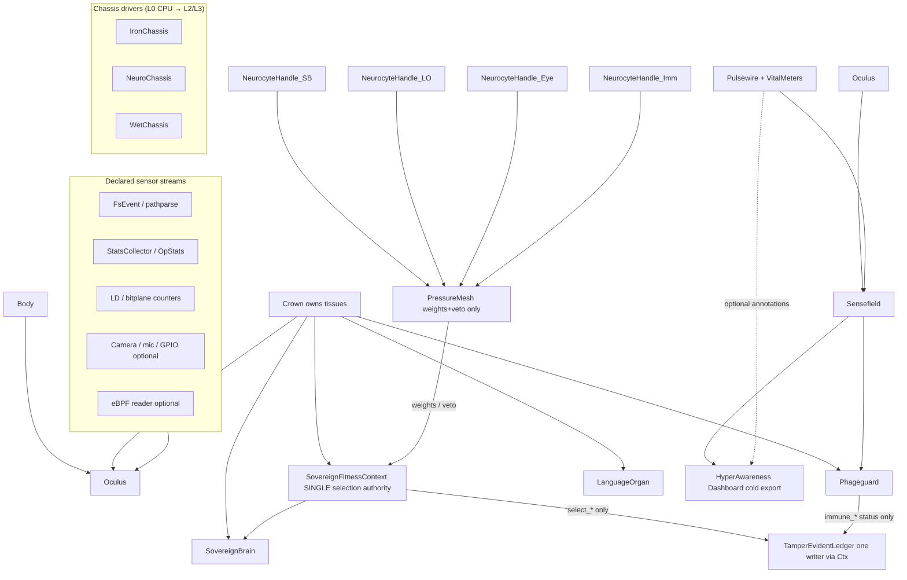
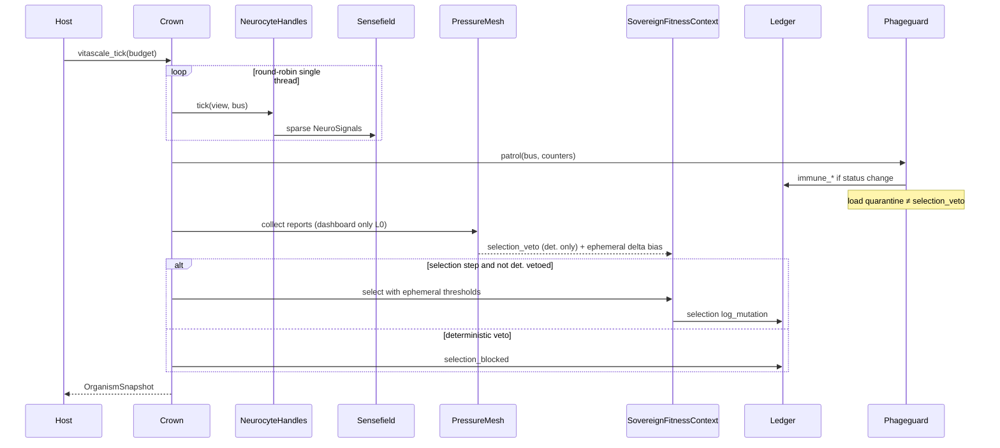
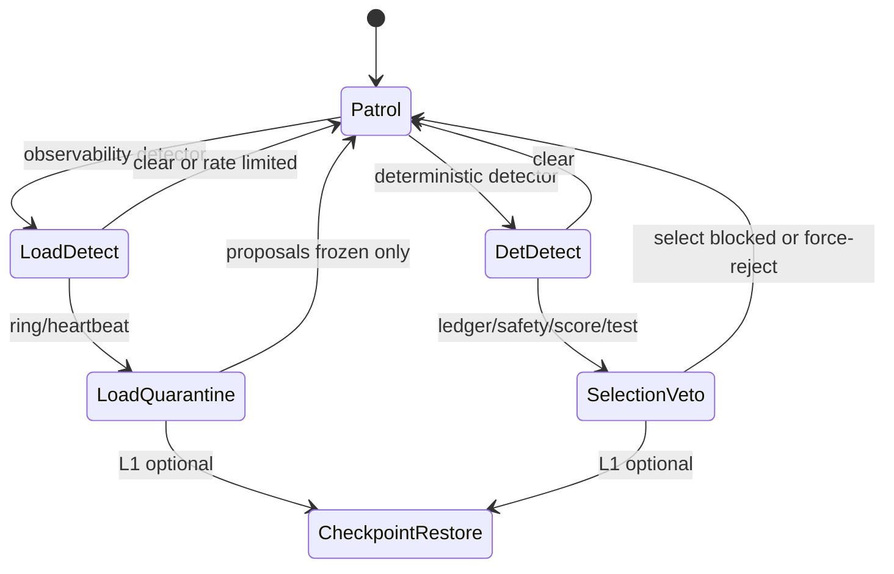
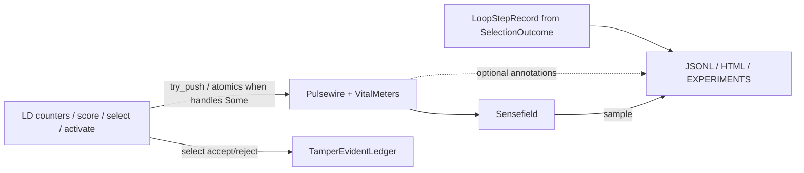

# VITASCALE Hostframe / Aethyro VITASCALE Architecture

| Field | Value |
|-------|--------|
| **Document** | VITASCALE Design — VITASCALE Hostframe |
| **Author** | (TBD) |
| **Date** | 2026-07-12 |
| **Status** | Draft (rev 4 — VITASCALE Hostframe naming; approved for PR-1) |
| **Depends on** | ADR 0002 (safety rails), ADR 0004 (ledger), ADR 0007 (observability prototype), ADR 0008 (Phase F vision), ADR 0009 (SovereignBrain), kernel Phases 0–5 COMPLETE, Genomic A–E COMPLETE |
| **Code roots** | `kernel/src/genomic/*`, `kernel/src/ntg/*` |
| **Honesty rule** | Engineering metaphors for continuous multi-scale control under rails — **not** claims of biological life, consciousness, or aethyro.com product readiness |

---

## 0. Naming bible (VITASCALE)

**Brand:** **VITASCALE Hostframe** — unique to this Aethyro build.  
**Feel:** biology *designs* the rules; **existing silicon is the life-support chassis** that keeps the host running — not a soft “organism metaphor,” a **host on iron**.

| Term | Meaning |
|------|---------|
| **VITASCALE** | The full architecture (next-level stage name for this build) |
| **Hostframe** | The running host: tissues + Crown + chassis, under rails |
| **Chassis** | Hardware life-support (CPU/MCU/neuromorphic/wetware adapters) |
| **IronChassis** | Default L0 chassis = host CPU/RAM/disk |
| **NeuroChassis** | Neuromorphic board adapter (L2) |
| **WetChassis** | Wetware body adapter (L3 research) |
| **Tissue** | A live subsystem unit; implements `Tissue` trait (Rust code may keep temporary type alias `Organ = Tissue` during migration) |
| **Neurocyte** | Agentic nano-brain **handle** for one live unit (not data owner) |
| **Crown** | Hierarchical assembly that owns tissues and forms the full host brain |
| **Gestalt** | Read-only complete-host view (all neurocytes + vitals) |
| **Pulsewire** | Binary hot-path event ring (live vitals, no JSONL) |
| **VitalMeters** | Atomic counters for throughput/drops/accepts |
| **Sensefield** | Multi-stream awareness fabric |
| **Oculus** | Vision/sensor fusion tissue (Omniradar 360° coverage) |
| **Omniradar** | Dashboard + fusion presentation (radar/bars/waves/matrix) |
| **Phageguard** | Immune defense tissue — detect, quarantine, ledgered defense (phage-cell analog) |
| **PressureMesh** | Federated selection pressure hints into single fitness context |
| **PulseEvent** | 32-byte hot telemetry record |
| **vitascale/** | Code module root under `kernel/src/genomic/vitascale/` |
| **KAIROS** | The **Child** — named host individual we raise (see [KAIROS.md](../KAIROS.md)) |

**Honesty line (unchanged):** engineering host that *behaves* under biological design rules on real iron — **not** a claim of biological life or consciousness.

### The Child

| | |
|--|--|
| **Name** | **KAIROS** |
| **Code** | `genomic/vitascale/kairos.rs`, bin `kairos_stage0` |
| **Stage 0** | Zygote: nursery genome + Pulsewire; Guardian forbids free agency |
| **Raise doc** | [docs/KAIROS.md](../KAIROS.md) |


## 1. Overview

The VITASCALE Hostframe is the unifying architecture that turns the existing Aethyro NTG research kernel — ternary compute, SIS graph, tamper-evident ledger, SovereignBrain multi-tissue stack, multi-axis fitness — into a **VITASCALE host** — biology-shaped intelligence kept alive on an iron chassis: sparse event signaling, hierarchical neurocyte agency, phage detect/quarantine (with snapshot repair staged honestly), multi-stream awareness, and optional hardware **Chassis** drivers (CPU → MCU/neuromorphic → wetware).

VITASCALE does **not** replace `SovereignBrain`, `Tissue`, `SovereignFitnessContext`, or ADR 0002 rails. It composes them. Hot-path life signs use a **Pulsewire** of binary events plus **VitalMeters** (no JSONL on LD / score / select / activate). Cold-path export, dashboards, and audit remain text/JSONL — with selection JSONL still **record-primary** from `LoopStepRecord`, not reconstructed from 32-byte events alone.

**Selection authority is singular:** `SovereignFitnessContext` remains the only path that scores axes, accepts/rejects mutants, and writes the ledger for selection. **PressureMesh** surfaces deterministic Phageguard `selection_veto` and ephemeral threshold bias only; L0 FitnessReports are dashboard/attention, not axis inputs. **Load-dependent** Phageguard signals (ring drops, heartbeat) may quarantine neurocyte **proposals** but **never** block genomic `select_*`. **Crown** owns tissues and holds exactly one fitness context (one ledger writer for selection).

Every live unit has a **Neurocyte** control handle (not a second owner of tissue data). Neurocytes compose under **Crown** into one **Gestalt**. **Oculus** and **Phageguard** are first-class `Tissue` implementors. **Sensefield** makes “Omniradar 360°” multi-stream observability with declared SLAs, not omniscience.

**Actionable path:** ship software-only Hostframe loops on the current Rust stack first (L0–L1); treat neuromorphic boards and Cortical Labs CL1-class wetware as **Chassis drivers** (L2–L3 research horizon), not prerequisites.

---

## 2. Background & Motivation

### 2.1 Current state (measured, not aspirational)

| Layer | Location | What exists today |
|-------|----------|-------------------|
| Ternary / bitplane hot compute | `ntg/storage/*`, `ntg/simd/*`, `genomic/bitsliced_genotypes.rs`, `ld_compute.rs` | Scalar golden + bit-sliced / sparse; LD popcount path ~11× measured |
| Graph + SIS | `ntg/graph/*`, `docparse`, `pathparse`, `fsevents`, `leafsignal` | Deterministic forward, structural mutation primitives |
| Self-mod | `ntg/mutation/*` (`SelfModConfig.enabled = false` by default) | Budget, fitness, rules, multi-axis |
| Ledger + lineage | `ntg/ledger/*` (`TamperEvidentLedger`, `StateSlotStore`, `ExecutionTrace`) | SHA-256 chain, SignedEntry; StateSlotStore has `lineage` / `verify_lineage` but is **private inside** the ledger today — no public slot API on `TamperEvidentLedger` |
| Observability | `ntg/observability/stats.rs`, `Telemetry4D` in `genomic/optimized_core.rs` | Lock-free OpStats aggregation; four named axes (structural/temporal/evolutionary/biological) |
| Sovereign multi-tissue | `genomic/sovereign_brain.rs`, `language_organ.rs`, `organ.rs` | Working set, LTM, `activate` / `activate_from_text`; only these two implement `Tissue` today |
| Selection | `sovereign_fitness.rs`, `selection_loop.rs` | Real multi-axis score + ledgered train/prune; optional **JSONL per step** from `LoopStepRecord` |
| Persist | `sovereign_persist.rs` | Snapshot dir: `ltm.jsonl`, `calib.wire`, `meta.json`, language docs; **not** full chromosome/synapse rehydrate; ledger not fully rehydrated |
| Bins | `sovereign_brain_demo`, `sovereign_campaign` | Synthetic + real multi-chr VCF campaign evidence in EXPERIMENTS.md |

ADR 0009 accepted SovereignBrain as multi-tissue substrate. ADR 0008 proposed (ideas only) real-time self-awareness, self-healing via StateBlots, and long-horizon synthetic-biology/robotics — without implementation. Harden pass (SOVEREIGN_HARDEN.md) closed foundation gaps: Tissue trait, shared loop, durable snapshot, JSONL.

### 2.2 Pain points

1. **Observability is cold-path first.** `run_selection_loop` appends JSONL strings on every step (`selection_loop.rs`). That is correct for demos and EXPERIMENTS.md, but wrong for LD/score/select/activate at campaign scale if it rides the hot path.
2. **Organs are few and hand-wired.** Only `SovereignBrain` and `LanguageOrgan` implement `Tissue`. No shared bus; no phage organ; no Oculus/sensor tissue; agents (`ChromosomeAgent`, `DomainAgent`) are query handlers, not composable nano-brains.
3. **Self-heal is specified, not built.** ADR 0008 Part 3 describes StateSlot checkpoints + lineage rollback; code has `StateSlotStore::lineage` / `verify_lineage` but slots are not exposed on the ledger, and tissue images are not in StateSlots. No Phageguard yet.
4. **“360° awareness” is a metaphor without a fabric.** Telemetry4D and StatsCollector exist; there is no multi-stream **Sensefield**, no ring buffer of binary events, no Oculus fusion, no dashboard contract beyond HTML/JSONL sketches.
5. **Body is implicit (host CPU).** Neuromorphic sparsity and wetware embodiment are research context, not adapter traits.
6. **Composition risk.** Growing features without a hierarchical Crown plan recreates a monolith — the opposite of “every piece has its own Agentic Intelligence.”

### 2.3 Why now

Sovereign stack is measured (train accept / prune reject under bio gates; ledger verifies; LTM activate hardened). The next leap is **architecture**, not another one-off tissue. VITASCALE freezes the Hostframe model so implementation can proceed as ordered PRs without overclaiming product or biology.

---

## 3. Goals & Non-Goals

### 3.1 Goals

| ID | Goal | Layer |
|----|------|-------|
| G1 | **Binary-first telemetry** on LD / score / select / activate hot paths via Pulsewire + VitalMeters; JSONL/text export off hot path only | L0 |
| G2 | **Neurocyte** control handles for every live unit; hierarchical composition into **Crown** (Gestalt), not a mega-module | L0 |
| G3 | **Sensefield** multi-stream observability + **Oculus** sensor fusion for honest Omniradar 360° dashboards | L0 bus/eye; L1 dashboard |
| G4 | **Phageguard** detection + quarantine + ledger under ADR 0002; repair via **named snapshot checkpoints** (not StateSlots alone) | L0 detect/quarantine; L1 full restore |
| G5 | **Homeostasis** controller: multi-rate host state views (structure, fitness, immune, awareness load) with sparse events | **L1 only** |
| G6 | **Chassis driver** trait for CPU (now), MCU/neuromorphic (near), wetware CL1-class (horizon) without rewriting tissues | L0 trait+HostCpu; L2/L3 stubs |
| G7 | Implementable PR plan; L0 invent-now vs L3 research-horizon labeled honestly | docs |
| G8 | Preserve: measure-don't-assume, self-mod OFF by default, air-gapped sovereign posture, discrete/ternary/bitplane hot path, no aethyro.com overclaim | all |

### 3.2 Non-Goals

| ID | Non-goal |
|----|----------|
| NG1 | Claiming the system is alive, conscious, or biologically equivalent to an organism |
| NG2 | Magical omniscience cameras or unbounded surveillance; Oculus is multi-sensor fusion of **declared streams** only |
| NG3 | Quantum biology as a CPU replacement (doctrine/oracle layer only, L3) |
| NG4 | Enabling continuous self-mod by default or bypassing ledger/budget/rollback |
| NG5 | Product UI parity with aethyro.com; WASM avatar as kernel dependency (ADR 0007 still holds) |
| NG6 | Full process-image checkpointing; persist remains portable snapshot + ledger/JSONL audit |
| NG7 | Shipping wetware or neuromorphic drivers in L0 software PRs |
| NG8 | Reconstructing full multi-axis `LoopStepRecord` from PulseEvent alone |
| NG9 | Using ring/bus timestamps as inputs to selection fingerprints or deterministic replay consensus |

---

## 4. Proposed Design

### 4.1 Invention layers (honesty ladder)

| Layer | Name | Ship when | Examples |
|-------|------|-----------|----------|
| **L0** | Invent-now software | Immediate PR series on current kernel | Pulsewire + VitalMeters, injection contract, Sensefield, Neurocyte handles, Crown + PressureMesh (weights/veto only), Phageguard detect/quarantine, Oculus streams, IronChassis, TissueLive, ledger slot API + pre-select checkpoint helper, vitascale_demo |
| **L1** | Integrated organism loop | After L0 green tests + EXPERIMENTS.md | Snapshot restore repair, homeostasis controller, Omniradar HTML/SVG dashboard, eBPF optional reader (Linux only, feature-gated), vitascale_campaign overhead gates |
| **L2** | Hardware Body | Board available + adapter CI | Neuromorphic event bus adapter (spike/event I/O), MCU UART/SPI sparse telemetry, power/thermal sensors as Oculus streams |
| **L3** | Research horizon | Explicit research track; no product claim | Wetware body (CL1/DishBrain-class), multi-rate twin coupling, quantum-biology oracle (advice, not execution) |

**Rule:** Code may *name* L2/L3 traits and stub adapters; runtime behaviour that depends on missing hardware must fail closed or no-op with ledger annotation — never pretend.

### 4.2 System architecture



### 4.3 Core invented components

#### 4.3.1 Pulsewire

**Problem:** Hot path must not allocate JSON strings (`selection_loop::append_jsonl` pattern is cold-path only).

**Design:** Fixed-capacity ring of packed binary **events** plus sibling **VitalMeters** (atomics). Producers: instrumented LD (sampled), score/select/activate (via context-held refs), Neurocyte heartbeats, Phageguard detectors. Consumers: Sensefield sampler, offline exporters, optional eBPF-side reader, dashboard tailer.

```text
// Conceptual layout — implement under kernel/src/genomic/vitascale/
#[repr(C)]
pub struct PulseEvent {
    pub tsc_or_ns: u64,      // host clock; observability-only (see §4.8)
    pub source: u16,         // TelemetrySource enum as u16
    pub kind: u16,           // EventKind
    pub gen: u32,            // organism / brain generation
    pub a: u32,              // payload slot A (counts, ids)
    pub b: u32,              // payload slot B
    pub c: u32,              // payload slot C
    pub flags: u32,          // low 24: accept/reject/path/severity; high 8: schema_version
}
// size: 32 bytes. schema_version in flags[31:24]; L0 uses version = 0.
```

| Field | Use |
|-------|-----|
| `source` | `Ld`, `Score`, `Select`, `Activate`, `Nano`, `Immune`, `Eye`, `Body`, `Ebpf` |
| `kind` | `Begin`, `End`, `Counter`, `Accept`, `Reject`, `Anomaly`, `Heal`, `StreamTick`, `Quarantine` |
| `a/b/c` | Op-specific: LD pairs done, utility milli-units, motif hits, agent_id, etc. — **not** full MultiAxisFitness |

**API sketch:**

```rust
pub struct Pulsewire { /* atomic head/tail, Box<[PulseEvent]> */ }

impl Pulsewire {
    pub fn try_push(&self, e: PulseEvent) -> bool; // drop-on-full, never block hot path
    pub fn drain_to(&self, out: &mut Vec<PulseEvent>, max: usize) -> usize;
}

pub struct VitalMeters {
    pub ld_pairs: AtomicU64,
    pub score_calls: AtomicU64,
    pub select_accept: AtomicU64,
    pub select_reject: AtomicU64,
    pub activate_calls: AtomicU64,
    pub ring_drops: AtomicU64, // full-ring pressure signal for Immune
}
```

##### Injection contract (KD13)

**No process-global `pulsewire_ring()`.** Preferred wiring:

1. **`SovereignFitnessContext` holds optional telemetry handles:**
   ```rust
   // conceptual fields on SovereignFitnessContext
   pub telemetry: Option<PulseHandles>, // ring + counters, shared via Arc or &
   ```
2. **`score` / `select_*` / organism paths** push events when `telemetry` is `Some`; zero cost when `None` (production default for micro-tests).
3. **`SovereignBrain::activate`:** either (a) optional parameter `telem: Option<&PulseHandles>` on a thin wrapper `activate_traced`, keeping existing `activate` signature for callers, or (b) optional field on brain set by Crown before tick. Prefer **(a) wrappers** to avoid changing every call site semantics.
4. **LD path:** do **not** plumb `&Pulsewire` through every popcount call. L0 default:
   - **VitalMeters only** on LD (atomic `ld_pairs` += N), sampled every 1:N batch completion.
   - Full `PulseEvent` for LD only if single-threaded campaign mode **or** after MPSC ring lands.
5. **Crown** owns the ring + counters; passes `PulseHandles` into context and wrappers at tick start.

##### Concurrency model (L0)

| Producer class | L0 policy |
|----------------|-----------|
| Serial select/score/activate | Single-thread `try_push` on shared ring (safe if only one tick thread) |
| Rayon-parallel LD | **VitalMeters only** (Relaxed atomics); no multi-writer ring until MPSC |
| Multi-thread organism (future) | Per-thread rings + merge drain, **or** MPSC ring with CAS slot claim — L1+ |

L0 scheduling of Neurocytes is **deterministic round-robin on one thread** (see §4.3.2). Parallel ticks deferred.

##### JSONL policy (record-primary)

**Keep building `LoopStepRecord` from live `SelectionOutcome` + context fields** exactly as today (`selection_loop.rs`). EXPERIMENTS.md JSONL schema remains **record-primary**.

Optional hybrid (additive only):

```text
append_jsonl(path, &rec)?;                    // existing multi-axis fields
if let Some(h) = &ctx.telemetry {
    // optional secondary line or extra keys: ring_drops, score_calls, last_event_ns
    append_telemetry_annotation(path, h)?;
}
```

Ring alone **cannot** reconstruct `u0/u1`, full task/bio/cost/safety pairs, cov/calib/genomic. A future versioned binary→JSON exporter is a separate schema (not PR-3 parity).

**Optional eBPF reader (L1, Cargo feature `ebpf_reader`):** Separate process/thread; events enter as `source=Ebpf`. Linux-only; off by default; no network. Mechanism: **mmap-exported ring snapshot or userspace drain socket to local pipe** — not uprobe-on-hot-path required for L1 spike. Spike is **PR-12a** before optional PR-13.

**Integration points:**

| Hot site | File | Instrumentation |
|----------|------|-----------------|
| LD bitparallel path | `genomic/ld_compute.rs`, `bitsliced_genotypes.rs` | VitalMeters + sampled 1:N; no per-pair event |
| `score` / axes | `sovereign_fitness.rs` | End event with utility milli-units in `a` when handles present |
| `select_child` / train / prune | `sovereign_fitness.rs` | Accept/Reject + mutation_id when handles present |
| `activate` / `activate_from_text` | wrappers in organism or optional param | motif hits, working-set len |
| `StatsCollector::record` | `ntg/observability/stats.rs` | optional sampled bridge |

#### 4.3.2 Neurocyte (“nano brain” control handle)

**Problem:** Chromosome agents and domain agents handle queries but lack lifecycle, fitness reporting, bus presence, and composition protocol.

**Ownership (KD14):** **Crown owns tissues.** Neurocyte is a **control handle**, not `Neurocyte<O: Organ> { organ: O }`.

```rust
pub struct NeurocyteHandle {
    pub agent_id: u32,           // namespace 0xAE000000 | local
    pub organ_key: OrganKey,     // e.g. Genomic, Language, Eye, Immune
    pub generation: u32,
    pub last_fitness: MultiAxisFitness,
    pub status: NanoStatus,      // Live | Quarantined | Hibernating
    pub desires_summary: i32,    // packed summary for StateSlot.desires only
    pub goal: LocalGoal,         // full goals live here, not in StateSlot
}

/// Multi-axis local targets; not stored in the 48-byte StateSlot body.
#[derive(Clone, Copy, Debug, Default)]
pub struct LocalGoal {
    pub task_target: f32,
    pub bio_floor: f32,
    pub max_structural_cost: f32,
    pub min_safety: f32,
}

impl LocalGoal {
    /// Pack a coarse summary into StateSlot.desires (i32): millunits of task_target in low 16,
    /// millunits of bio_floor in high 16. Lossy by design — full LocalGoal is authoritative.
    pub fn to_desires_i32(&self) -> i32 { /* ... */ }
}

pub trait NanoBrain {
    fn agent_id(&self) -> u32;
    fn organ_key(&self) -> OrganKey;
    fn tick(&mut self, asm: &mut CrownView, bus: &mut Sensefield) -> NanoTickResult;
    fn local_fitness(&self, asm: &CrownView) -> MultiAxisFitness;
    fn propose(&self) -> Option<NeuroProposal>; // inert until Crown + SelfMod path
}
```

**StateSlot mapping:** `desires: i32` remains the ledger store’s arbitrary encoding field — **summary signal only**. Authoritative goals live in `LocalGoal` on the handle (or Crown side table).

**`ChromosomeAgent` / `DomainAgent`:** remain **query adapters / nano precursors**. They must **not** become second owners of `ChromosomeBrain` maps already held in `SovereignBrain`. If wrapped, they borrow or re-query through Crown’s brain reference.

**Scheduling (L0):** deterministic **round-robin** `tick` on a single thread. Sequence diagrams that say “parallel” are **L1+ deferred** only. Parallel `&mut` ticks on shared tissues are not free and are out of L0 scope.

Neurocytes are **not** LLMs. They are bounded control automata with optional rule-based proposals — same epistemic shape as `MutationRule` / selection loop.

#### 4.3.3 Crown (full Crown composition) & selection authority

**Problem:** Hierarchical composition into one full Crown without a monolith; avoid dual fitness ownership.

##### Single selection authority (KD15)

| Role | Owner | Responsibility |
|------|-------|----------------|
| Score multi-axis, accept/reject, log selection mutations | **`SovereignFitnessContext` only** | Existing `score`, `select_child`, `select_train_step`, `select_prune_step` |
| Aggregate nano reports for dashboard / attention | **`PressureMesh`** | L0: does **not** alter axis values; may surface `selection_veto` from **deterministic** Phageguard only; does **not** call `log_mutation` for selection |
| Detect/quarantine; log `phage_*` status | **`Phageguard`** | Split outcomes: **selection_veto** (deterministic only) vs **load quarantine** (observability / proposal freeze only) — see §4.3.6 / KD16 |
| Own tissues + one context + ring/bus | **`Crown`** | Single place that constructs `SovereignFitnessContext` / ledger |

**Call graph:**

```text
vitascale_tick(budget):
  for nano in round_robin_order:
    nano.tick(view, bus)           # may emit bus signals; no select
  immune.patrol(bus, ring, ctx)
    # → selection_veto: ONLY deterministic detectors (ledger/safety/score gates/test inject)
    # → load_actions: ring_drops / heartbeat → per-nano quarantine + stress flags
    #   MUST NOT set selection_veto or skip genomic select_*
  reports = collect local_fitness via handles   # observability / dashboard only (L0)
  fed = federation.combine(reports, immune.selection_veto())  # veto from det. Phageguard only
  # Ephemeral thresholds (never sticky-mutate ctx.evaluator):
  base_delta = ctx.evaluator.min_utility_delta
  base_slack = ctx.evaluator.bio_slack
  effective_delta = base_delta + fed.min_utility_delta_bias   # bias from det. sources only in L0
  if selection_requested && !fed.veto_accept:
    outcome = ctx.select_*_with_thresholds(brain, effective_delta, base_slack)
      # OR: save evaluator → set → select_* → restore in finally (see §5.3)
    # LoopStepRecord built from outcome as today
  else if fed.veto_accept:   # deterministic Phageguard only
    ledger phage v1 action=selection_blocked ... (no topology change)
  # load_quarantined nanos: proposals frozen; genomic select_* still runs
```

**`run_selection_loop` coexistence:** remains the **standalone** API for demos/campaigns that only touch brain+context. `run_vitascale_loop` wraps Crown and **calls into the same** `select_*` methods on the Crown-owned context — never a parallel scorer. Double-scoring is avoided by: one context, one select call per step, federation runs **before** select as hint only.

**L0 FitnessReport policy (KD8/KD15):** `FitnessReport` / `local_fitness` samples are **observability, dashboard, and Phageguard attention only**. They **do not** alter `MultiAxisFitness` axis values produced by `SovereignFitnessContext::score`. `per_organ` blend weights are **reserved L1; ignored by `federate()` in L0**.

**Oculus/Phageguard and MultiAxisFitness (KD8 preserved):**

| Source | Maps to |
|--------|---------|
| Genomic + language task scores | existing task axis via context |
| Biology / LD coverage | existing bio axis |
| Structure metrics | existing structural_cost |
| Ledger verify | existing safety (also deterministic selection_veto if fail) |
| Oculus coverage shortfall | **dashboard / stress flag only in L0** — does **not** change `min_utility_delta` or skip select |
| Phageguard **selection_veto** (deterministic only) | may skip `select_*` or force-reject; see detector class table §4.3.6 |
| Phageguard **load quarantine** (ring/heartbeat) | freeze that nano’s **proposals** only; **never** blocks genomic `select_*` |

No parallel utility formula.

**Registry:**

1. Organs owned by Crown: `SovereignBrain`, `LanguageOrgan`, `Oculus`, `Phageguard`, …
2. NeurocyteHandles keyed by `agent_id`
3. Shared `Sensefield` + `Pulsewire` + `VitalMeters`
4. Exactly one `SovereignFitnessContext` (ledger writer for selection)
5. Phageguard may append ledger entries via context helper `log_phage_event(...)` that uses the **same** ledger



**Composition protocols:**

| Protocol | Purpose |
|----------|---------|
| `NeuroSignal` | Sparse typed event on bus |
| `FitnessReport` | Per-nano sample for dashboard / attention (L0: not scored into axes) |
| `NeuroProposal` | Suggested change; inert until rails + context path; frozen if load-quarantined |
| `QuarantineOrder` | Issued only by Immune; class = `Load` or `Deterministic` |
| `BodyFrame` | Chassis driver I/O envelope |

##### CrownView (L0 nano tick surface)

`NanoBrain::tick` takes `&mut CrownView` so handles never own tissues. L0 methods (keep small to avoid borrow fights in round-robin):

```rust
/// Read-mostly façade over Crown for one neurocyte tick. Mutating methods only
/// touch bus/handle tables — not SovereignBrain topology (selection owns that).
pub struct CrownView<'a> { /* internal refs */ }

impl CrownView<'_> {
    pub fn organ_health(&self, key: OrganKey) -> f32;
    pub fn structure_fingerprint(&self, key: OrganKey) -> u64;
    pub fn is_quarantined(&self, agent_id: u32) -> bool;
    pub fn quarantine_class(&self, agent_id: u32) -> Option<QuarantineClass>; // Load | Deterministic
    pub fn push_signal(&mut self, sig: NeuroSignal); // into Sensefield
    pub fn counters(&self) -> &VitalMeters;           // read-only rates for dashboards
    // L0: no activate_mut / no select / no ledger write from nanos
}
```

**Complete brain (end state):** Crown presents **Gestalt** (`score` → context, `activate` → brain wrappers, `tick`, `snapshot`). One interface, multiple tissues — not one source file.

#### 4.3.4 Sensefield

In-process pub/sub with **bounded queues per topic** and **drop-with-counter** semantics. Not a network bus in L0. Single-threaded L0 ticks → deterministic drain order for a given signal sequence; concurrent producers (L1+) make drop order non-consensus (see §4.8).

```rust
pub enum StreamId {
    Structural,
    Temporal,
    Evolutionary,
    Biological,
    Immune,
    Eye(u16),
    Body(u16),
    Nano(u32),
}

pub struct NeuroSignal {
    pub stream: StreamId,
    pub severity: u8,
    pub code: u16,
    pub payload: [u32; 4],
    pub t_ns: u64, // observability-only
}
```

**Omniradar 360° (honest definition):**

> Continuous fusion of **all registered streams** into a dashboard and Phageguard attention set, with time as the animating dimension. Coverage is **declared stream completeness vs SLA**, not omniscience. “Nothing gets past awareness” means: no registered stream is unsampled beyond its SLA, and drops are themselves visible stress signals.

#### 4.3.5 Oculus (vision / multi-sensor fusion)

**Not** magic cameras only. Oculus is the sensory cortex of **declared streams**.

| Stream class | L0 sources | Default SLA (freshness) |
|--------------|------------|-------------------------|
| Structural | `StructuralMetrics`, storage density, StatsCollector path mix | 1.0 s |
| Temporal | Ledger verify boolean/rate, replay health | 1.0 s |
| Evolutionary | last selection accept/reject, utility delta | per selection step (or 1.0 s if idle) |
| Biological | `last_ld_coverage`, validation scores | 1.0 s after score |
| Host FS | `FsEvent` / pathparse | on event (event-driven; stale if no events is OK) |
| Media | optional feature-gated capture | 100 ms if registered; else unregistered |

**Coverage:**

```text
coverage = count(streams where now - last_sample <= sla) / count(registered_streams)
```

Unregistered streams do not count against coverage.

**Fusion weights (L0 defaults, deterministic pure function):**

| Axis / field | Weight |
|--------------|--------|
| structural sample | 0.25 |
| temporal sample | 0.25 |
| evolutionary sample | 0.20 |
| biological sample | 0.20 |
| oculus_extra health (drop rates, FS) | 0.10 |

```rust
pub struct Oculus {
    pub streams: Vec<EyeStream>,
    pub last_fusion: AwarenessFrame,
    pub coverage: f32,
}

impl Tissue for Oculus { /* kind = "oculus_awareness" */ }

pub struct AwarenessFrame {
    pub axes: Telemetry4D,   // reuse existing type
    pub oculus_extra: [f32; 8],
    pub generation: u64,
    pub coverage: f32,
}
```

#### 4.3.6 Phageguard (self-heal analog — honest repair model)

Extends ADR 0002 + ledger + (eventually) exposed StateSlots. **Does not claim StateSlots alone heal brains.**

##### Repair target model (critical)

| Mechanism | What it stores | Can restore tissues? |
|-----------|----------------|---------------------|
| `StateSlot` (48 B) | `agent_id`, `desires` summary i32, `fitness_int`, `parent_offset`, `generation`, `timestamp` | **No** — control/lineage metadata only |
| `sovereign_persist` snapshot dir | LTM, calib, meta, optional language docs | **Partial** — not full chromosome/synapse map; needs VCF re-ingest for bodies |
| Pre-select **checkpoint** (new) | Named dir from `save_snapshot` (+ crown_meta) taken **before** risky select | **Yes for what snapshot covers**; document restore limits in EXPERIMENTS |
| Ledger chain | mutation descriptions, fingerprints, traces | Audit/verify only — not organ image |

**Staged phage capability:**

| Stage | Behavior |
|-------|----------|
| **L0** | Detect + **quarantine** with **class split** (below) + mandatory ledger `phage_*` on Live↔Quarantined. Synthetic/forced detectors for tests. **No claim of brain heal via StateBlots.** |
| **L0/L1 repair v1** | **Named snapshot directory** restore via `load_snapshot_into` (+ re-attach eye/immune). Document restored vs not (chromosomes require re-ingest). |
| **L1+** | Public ledger slot API for nano control lineage; optional richer checkpoints |

**Ledger surface required (PR-5b):**

```rust
// Add to TamperEvidentLedger (or thin ImmuneStateStore wrapping the private slots)
impl TamperEvidentLedger {
    pub fn write_agent_slot(&mut self, slot: StateSlot) -> Result<usize, NtgError>;
    pub fn agent_lineage(&self, agent_id: u32) -> Result<Vec<StateSlot>, NtgError>;
    pub fn verify_agent_lineages(&self) -> Result<(), NtgError>;
    /// Thin wrapper over log_mutation — see contract below. Not a second audit channel.
    pub fn log_phage_event(&mut self, grammar: &str, structure_fp: u64) -> Result<u64, NtgError>;
}

// PR-5b contract for log_phage_event:
// 1. MUST call existing log_mutation (same chain / SignedEntry / traces map).
// 2. description = phage grammar string (§8.3).
// 3. pre_fingerprint = post_fingerprint = structure_fp (status-only: same fp both sides;
//    use brain.structure_fingerprint() or 0 if no organ touch).
// 4. outcome = MutationOutcome::RejectedFitnessGate for block/quarantine without topology
//    accept, OR extend enum later with ImmuneStatus — L0 reuses RejectedFitnessGate /
//    Accepted only if a checkpoint restore actually applied (L1).
// 5. ExecutionTrace: minimal single ordered event (same pattern as select_child:
//    with_fingerprint → record_event(0, fp, fp, ts) → set_output_hash(fp)).
// 6. Unit test: N phage events then verify_full_ledger() == Ok.
```

Today `slots` is private and only `log_mutation` / `verify_full_ledger` / entries / traces are public — **PR-5b is a hard prerequisite** for honest control-lineage, not for L0 quarantine.

##### L0 Phageguard implementation shape (cells as docs only)

No five empty phage-cell types in L0. Single organ:

```rust
pub enum DetectorClass {
    /// May set selection_veto / skip or force-reject select_*. Pure in scored state + ledger.
    Deterministic,
    /// May load-quarantine a nano (proposals only). MUST NOT set selection_veto.
    Observability,
}

pub enum QuarantineClass {
    Load,           // ring/heartbeat/etc. — proposals frozen; select_* still runs
    Deterministic,  // accompanies selection_veto; may freeze proposals too
}

pub struct ImmuneConfig {
    pub utility_regression_tau: f32,  // default 0.05
    pub immune_slack: f32,            // default 0.02
    pub max_quarantines_per_sec: u32, // default 8 — rate limit for Load class only
    pub ring_drop_rate_threshold: f32,// default 0.01 of pushes (Observability only)
}

pub struct Phageguard {
    pub config: ImmuneConfig,
    pub detectors: Vec<DetectorFn>,
    pub memory: Vec<u16>,
    pub quarantined: BTreeMap<u32, QuarantineClass>, // agent_id → class
    pub selection_veto: bool, // true only if a Deterministic detector fired this patrol
}

// Sentinel/Phagocyte/Repairase/MemoryB/Regulator = documentation roles only.
```



##### Detector class table (KD16 complete split)

| Detector | Signal | Class | May set `selection_veto`? | May load-quarantine nano? | Notes |
|----------|--------|-------|---------------------------|---------------------------|-------|
| Ledger verify fail | `verify_full_ledger` Err | **Deterministic** | **Yes** | Yes (optional) | Same on identical ledger state |
| Safety axis collapse | `score_safety() == 0` | **Deterministic** | **Yes** | Yes | From same `score()` path |
| Utility regression | Δ utility &lt; −τ from **this step’s** baseline/candidate scores | **Deterministic** | **Yes** (force-reject path preferred over skip) | No | Pure in scored axes |
| Bio gate breach | bio drop &gt; bio_slack on **this step’s** scores | **Deterministic** | **Yes** (force-reject) | No | Already in `accept_candidate` |
| Forced test inject | harness flag | **Deterministic** | **Yes** | Yes | Tests only |
| Ring pressure | `ring_drops` rate | **Observability** | **No** | Yes (non-genomic nanos; never blocks `select_*`) | Load-dependent |
| Nano heartbeat silence | wall-clock tick SLA | **Observability** | **No** | Yes (that agent only) | Load-dependent |
| Oculus coverage shortfall | coverage &lt; 1 | **Observability** | **No** | No (stress flag only) | Dashboard |

**Hard rule (Phageguard + KD16):**  
`selection_veto` ⇔ at least one **Deterministic** detector fired.  
Observability detectors **must not** skip `select_train_step` / `select_prune_step` / `select_child`, must not force `should_accept == false` via veto, and must not quarantine the **genomic selection pipeline** (Crown still calls context select). Load quarantine freezes **`NeuroProposal` admission** and optional non-selection mutators for that agent only.

**Actions:**

1. **Load quarantine (L0):** `NanoStatus::Quarantined` + `QuarantineClass::Load`; block `NeuroProposal` apply for that agent; **genomic `select_*` continues**.
2. **Deterministic veto (L0):** set `selection_veto`; skip select or force-reject with ledger `selection_blocked` / reject; optional Deterministic quarantine on related agents.
3. **Checkpoint restore (L1):** load named snapshot dir; re-verify ledger; document partial restore.
4. **Ledger:** every Live↔Quarantined transition **must** log grammar including `class=load|deterministic` (§8.3).
5. **Budget:** wall-time rate limits apply to **Load** quarantines only; not fitness fingerprints (§4.8).
6. **Never:** open-ended host process code rewrite; never elevate ring/heartbeat to selection_veto without a new design ADR.

#### 4.3.7 Multi-rate host state views (ex–“digital twin”)

Implementer-facing name: **multi-rate host state views**. Biology “digital twin” language is **doctrine only** (G5 is L1).

| Rate | Content | Update |
|------|---------|--------|
| Micro | VitalMeters, sampled PulseEvents | every N ops / ms |
| Meso | organ fingerprints, nano fitness | every vitascale_tick |
| Macro | MultiAxisFitness utility, Phageguard state, generation | every selection step |
| Meta | durable snapshot + ledger head hash | on consolidate / checkpoint |

**Homeostasis controller (L1 PR-11):** adjusts working-set capacity / prune_frac / sample rates / Phageguard thresholds as **proposals** under rails. **Stress phenotype (L1):** reduced activate capacity + raised `min_utility_delta` + higher telemetry sample rate when Phageguard quarantine or Body stress flags fire. Measure via existing task/bio axes.

**Durable genome:** ternary DNA nodes + sovereign snapshot + crown_meta. Mutants ledgered via context.

### 4.4 Chassis drivers

```rust
pub struct BodyHealth {
    pub ok: bool,
    pub power: Option<f32>, // normalized if known
    pub temp: Option<f32>,  // Celsius if known
    pub link: f32,          // 0..1 connectivity to adapter
    pub viability: f32,     // 1.0 for CPU; wetware later
}

pub trait BodyAdapter {
    fn body_kind(&self) -> &'static str;
    fn poll_frame(&mut self) -> Option<BodyFrame>;
    fn push_actuators(&mut self, cmd: &BodyCommand) -> Result<(), BodyError>;
    fn health(&self) -> BodyHealth;
}

/// L0 IronChassis: portable no-op sensors.
/// health() -> BodyHealth { ok: true, power: None, temp: None, link: 1.0, viability: 1.0 }
/// Optional Linux /proc/stat sampling is best-effort, never fitness-critical, never in fingerprints.
pub struct IronChassis { pub best_effort_proc: bool }

// L2/L3: feature-gated stubs only
```

Stress phenotype must **not** require thermal sensors in L0; Body stress flag is false unless optional sampling says otherwise.

### 4.5 Real-time visualization (Hyper-Awareness Dashboard) — L1

**Consumes:** optional ring drain annotations, `Telemetry4D`, Phageguard state, Oculus coverage, **record-primary** selection JSONL, ledger verify waveform.

| View | Data |
|------|------|
| Radar / spider | task, bio, safety, structure_good, immune_health, oculus_coverage |
| Bars | VitalMeters rates |
| Waves | utility over generations; ledger verify flatline |
| Matrix | organ × metric heatmap |
| Graph | Crown neurocyte topology |
| Ring HUD | drop rate, fill %, source mix |

Cold path only. Zero-dep HTML/SVG first (`results/report.html` pattern). Dashboard can also consume **existing JSONL alone** (see A8); full bus-powered views need L0 bus.

### 4.6 Module layout

```text
kernel/src/
  genomic/
    vitascale/              # ALWAYS compiled (like sovereign stack) — no default feature gate
      mod.rs
      telemetry_ring.rs
      awareness_bus.rs
      nano_agent.rs
      assembly.rs
      fitness_federation.rs
      oculus_organ.rs
      immune_organ.rs
      homeostasis.rs       # L1
      organ_live.rs        # TissueLive trait
      body/
        mod.rs
        host_cpu.rs        # L0 always
        neuromorphic.rs    # cfg feature body_neuromorphic
        wetware.rs         # cfg feature body_wetware
    organ.rs
    selection_loop.rs      # record-primary JSONL; optional telemetry annotations
    sovereign_*.rs         # instrument via handles/wrappers
  ntg/
    ledger/                # public slot + phage log helpers (PR-5b)
    observability/
    mutation/              # SelfModConfig remains OFF default
  bin/
    vitascale_demo.rs       # [[bin]] always registered like sovereign_*
    vitascale_campaign.rs   # L1
```

**Cargo features (`kernel/Cargo.toml` today has none):**

| Feature | Default | Purpose |
|---------|---------|---------|
| _(none for L0 organism)_ | L0 modules always compiled | Avoid feature matrix pain |
| `ebpf_reader` | off | Linux optional reader + any deps |
| `body_neuromorphic` | off | Stub/hardware glue |
| `body_wetware` | off | Research stub |

Bins follow existing `[[bin]]` pattern in `Cargo.toml`.

### 4.7 Data flow (hot vs cold)



### 4.8 Observability vs determinism (ADR 0002 rail 4)

**Rule (KD16 — complete):** Split all Immune/telemetry effects into two channels:

| Channel | Sources | May affect `select_*` run / accept? | May affect fingerprints / axes? |
|---------|---------|-------------------------------------|----------------------------------|
| **Observability** | ring timestamps, ring_drops, bus drop order, heartbeat wall-clock, `/proc`, Oculus coverage, Load quarantine | **No** | **No** |
| **Deterministic control** | `verify_full_ledger`, `score_safety()`, this-step utility/bio gates, forced test inject | **Yes** (`selection_veto` or force-reject) | Axes only via normal `score()`; fingerprints remain structure fingerprints |

They must **not** enter:

- ledger `pre_fingerprint` / `post_fingerprint` (structure fingerprints only),
- `MultiAxisFitness` axis values from observability signals,
- deterministic replay of `ExecutionTrace` consensus from wall-clock or drop counts.

**Selection purity:** Given the same brain topology, same frozen references, same evaluator baselines, and same deterministic Phageguard inputs (ledger integrity + scored axes + test inject flag), `select_*` either runs or is vetoed **identically** across hosts/loads. Ring pressure and heartbeat silence may change dashboard stress and which nanos may **propose**, but two identical campaigns under different CPU load must not diverge on whether train/prune selection executes.

Phageguard may use wall time for **Load quarantine rate limiting** only; the ledgered outcome (class + reason) is what auditors read for status changes.

---

## 5. API / Interface Changes

### 5.1 TissueLive (backward compatible)

Keep existing `Tissue` unchanged. Add:

```rust
pub trait TissueLive: Tissue {
    fn on_bus_signal(&mut self, sig: &NeuroSignal) {}
    fn health(&self) -> f32 { 1.0 }
}
```

Landed in **PR-5c** with Oculus/Immune; SovereignBrain/LanguageOrgan get adapters when needed.

### 5.2 Selection loop

- Keep `run_selection_loop` signature and **record-primary** JSONL.
- Optional telemetry annotation fields when context has handles.
- Add `run_vitascale_loop(assembly, steps, export)` that calls the same `select_*` APIs.

### 5.3 Fitness federation

```rust
pub struct FederationWeights {
    /// Reserved L1 — ignored by federate() in L0. Do not blend into axes yet.
    pub per_organ: BTreeMap<&'static str, f32>,
    /// L0: only copied from immune.selection_veto (Deterministic class).
    pub allow_selection_veto: bool, // default true
    /// L0: must be 0.0 unless sourced from deterministic config (not Oculus/load).
    pub min_utility_delta_bias: f32,
}

pub struct PressureHint {
    /// True only from Phageguard Deterministic selection_veto — never from ring/heartbeat.
    pub veto_accept: bool,
    pub min_utility_delta_bias: f32,
    /// Dashboard / attention only; not a 5th utility term; does not skip select.
    pub stress: f32,
}

pub fn federate(
    reports: &[FitnessReport], // L0: unused for axes; may set stress max
    immune: &Phageguard,
    w: &FederationWeights,
) -> PressureHint {
    // veto_accept = w.allow_selection_veto && immune.selection_veto
    // stress = max(report stress, immune.load_stress()) — observability only
}
```

**L0:** FitnessReports do not alter MultiAxisFitness. Veto path preferred:

```rust
if hint.veto_accept {
    return TickResult::Blocked { reason: "immune_selection_veto_deterministic" };
}
```

**Ephemeral evaluator apply (no sticky bias):**

```rust
// Preferred: do not mutate ctx.evaluator at all —
// pass effective_delta into a one-shot should_accept call.

// If mutating for reuse of existing select_*:
let saved_delta = ctx.evaluator.min_utility_delta;
let saved_slack = ctx.evaluator.bio_slack;
ctx.evaluator.min_utility_delta = saved_delta + hint.min_utility_delta_bias;
let outcome = ctx.select_train_step(brain, cycles);
ctx.evaluator.min_utility_delta = saved_delta; // restore always (defer/finally)
ctx.evaluator.bio_slack = saved_slack;
// Unit test: after N ticks with bias, evaluator.min_utility_delta == initial
```

### 5.4 Capability bit

Extend `ternary_capability` / version only after L0 tests green + STATUS sync (e.g. `organism_telemetry_supported`).

### 5.5 Ledger — `log_phage_event` is `log_mutation`

Not a parallel audit list. Implementation contract (PR-5b):

1. Call `TamperEvidentLedger::log_mutation` with `description` = §8.3 grammar string.
2. `pre_fingerprint == post_fingerprint` for pure status events (structure unchanged).
3. Minimal `ExecutionTrace` (one ordered event) matching `select_child` pattern so `verify_full_ledger` stays green.
4. Reuse `MutationOutcome` variants in L0 (`RejectedFitnessGate` for quarantine/block without accept; do not invent a second chain).
5. Test: append many phage events → `verify_full_ledger()` Ok.

---

## 6. Data Model Changes

### 6.1 New durable artifacts

| Artifact | Format | Notes |
|----------|--------|-------|
| `telemetry.bin` | binary events; flags high byte = schema 0 | optional campaign export |
| `awareness.jsonl` | cold NeuroSignals | demos |
| phage events | ledger via structured grammar | mandatory on status change |
| `crown_meta.json` | organ list, agent_ids, body kind | |
| StateSlots | existing 48-byte; desires = summary i32 | nano control lineage after PR-5b |
| checkpoint dirs | `save_snapshot` + crown_meta | pre-select; restore limits documented |

### 6.2 Migration

- No breaking change to `ltm.jsonl` / `calib.wire` / `meta.json`.
- Crown load: restore sovereign snapshot then reattach Oculus/Phageguard; chromosomes still need re-ingest for full topology.
- Ledger format: new helper APIs; description grammar additive.

### 6.3 Storage estimates

| Component | Rough size |
|-----------|------------|
| Pulsewire 64K × 32 B | 2 MiB fixed |
| Sensefield queues | < 1 MiB |
| Phageguard memory codes | < 256 KiB |
| Dashboard HTML | tens of KB |

---

## 7. Alternatives Considered

### A1. JSONL everywhere on hot path (status quo extended)

- **Pros:** Simple, greppable, already in `selection_loop`.
- **Cons:** Alloc/format cost; fights bitplane culture.
- **Decision:** Reject for hot path; keep as record-primary cold export.

### A2. Monolithic OrganismBrain mega-struct

- **Pros:** Single place to look.
- **Cons:** Contradicts nano composition; untestable god object.
- **Decision:** Reject; Crown registry + protocols.

### A3. External observability (OpenTelemetry + Prometheus)

- **Pros:** Industry standard.
- **Cons:** Network/deps vs air-gap zero-dep culture.
- **Decision:** Defer; optional L2 host tool outside kernel.

### A4. Full eBPF-first kernel organism

- **Pros:** OS-level live read.
- **Cons:** Linux-only, privileged, complex CI.
- **Decision:** Optional L1 after spike PR; not core L0.

### A5. Immediate wetware integration

- **Pros:** Narrative max.
- **Cons:** Not implementable in-repo; overclaim risk.
- **Decision:** L3 Body stub only.

### A6. Extend StatsCollector / VitalMeters only (no event ring)

- **Pros:** Minimal code; already lock-free; enough for rate dashboards.
- **Cons:** No typed anomaly kinds, no begin/end spans, weak Phageguard forensics, hard to correlate accept/reject with generation without side tables.
- **Decision:** **VitalMeters are mandatory; ring is L0 for typed events.** Counters-only is insufficient as the sole L0 plan but is the **correct LD parallel path** until MPSC.

### A7. `std::sync::mpsc` / crossbeam instead of custom ring

- **Pros:** Familiar; less custom concurrency code.
- **Cons:** Allocating messages; unbounded or mutex queues; new deps if crossbeam; not fixed 32 B layout for mmap/eBPF share; hot path cost.
- **Decision:** Custom fixed ring for zero new deps + stable layout; mpsc acceptable only for **cold** dashboard process boundary, not LD/score.

### A8. Phageguard as selection_loop middleware only (not an Organ); dashboard from JSONL only

- **Pros:** Smaller L0; detectors next to existing select; dashboard can ship from current JSONL without bus.
- **Cons:** Breaks composition symmetry (Oculus/Phageguard as tissues); harder multi-tissue quarantine; middleware tends to fork selection_loop.
- **Decision:** **Phageguard is a Tissue** for Crown symmetry, but **first detectors may be invoked from the vitascale/selection path** (patrol called around select). Dashboard MVP may use JSONL alone (L1 can start thin); full radar with oculus_coverage needs Oculus + export.

---

## 8. Security & Privacy Considerations

### 8.1 Privilege matrix

| Actor | May quarantine | May clear quarantine | May select/mutate topology | May write ledger | May enable self-mod |
|-------|----------------|----------------------|----------------------------|------------------|---------------------|
| Host binary / operator | via Crown API | via Crown API | constructs context; explicit | yes | only by config flag |
| Crown root | receives Phageguard orders | yes (operator policy) | calls context.select_* | via context | respects SelfModConfig |
| Phageguard | **yes** (only path for auto quarantine) | **no** (Crown/Host only) | **no** | phage events only | **no** |
| NeurocyteHandle | **no** | **no** | propose only (inert) | **no** | **no** |
| Oculus | **no** | **no** | **no** | **no** | **no** |

### 8.2 Threat table

| Threat | Severity | Mitigation |
|--------|----------|------------|
| Self-mod runaway | High | ADR 0002: OFF default, budget, rollback, ledger |
| Phageguard false positive storm | Medium | `immune_slack`, `max_quarantines_per_sec` (default 8), severity thresholds |
| Phageguard / crown host code rewrite | Critical | **Forbidden** |
| eBPF privilege | High | Feature-gated, off default, no remote export |
| Oculus media privacy | High | Explicit opt-in streams; local only |
| Ledger spoof | High | SHA-256 chain verify; critical Phageguard detector |
| NeuroProposal flood | Medium | Admission budget: max proposals per tick (default 2); SelfMod still off |
| Dual ledger writers | Medium | Single context-owned ledger; Phageguard uses same handle |

### 8.3 Structured phage ledger grammar (mandatory)

Prefix convention alone is insufficient. L0 uses a stable token grammar inside `description` (until a typed ledger body exists):

```text
phage v1 action=quarantine class=deterministic agent=0xAE000003 reason=ledger_verify code=1 gen=12 prev=live
phage v1 action=quarantine class=load agent=0xAE000007 reason=ring_drops code=3 gen=12 prev=live
phage v1 action=selection_blocked class=deterministic reason=ledger_verify code=1 gen=12
phage v1 action=release agent=0xAE000003 reason=operator gen=13 prev=quarantined
phage v1 action=checkpoint_restore path=... verify=OK gen=14
phage v1 action=detect_only class=load reason=ring_drops code=3
```

**Mandatory:** any Live↔Quarantined↔Hibernating transition = ledger entry with `class=load|deterministic`. Detect-only may be sampled to avoid storms. `class=load` **never** pairs with `action=selection_blocked`.

### 8.4 Defaults

| Parameter | Default |
|-----------|---------|
| `utility_regression_tau` | 0.05 |
| `immune_slack` | 0.02 |
| `max_quarantines_per_sec` | 8 |
| `max_proposals_per_tick` | 2 |
| `ring_drop_rate_threshold` | 0.01 |

---

## 9. Observability

| Signal | Source | Alert / Phageguard |
|--------|--------|----------------|
| ops/s, path mix | StatsCollector | structural stream |
| ring_drops | VitalMeters | medium anomaly |
| utility waveform | selection records | evolutionary stream |
| ledger verify | TamperEvidentLedger | critical if fail |
| eye coverage | Oculus | medium if < 1.0 sustained |
| quarantine count | Phageguard | high if rising |
| body health | BodyAdapter | optional; not fitness-critical L0 |

**Targets (remeasure on host):**

| Path | Target |
|------|--------|
| `try_push` | microbench published in PR-1 (ns/op on host) |
| LD instrumentation overhead | **&lt; 1%** bitparallel wall time on pinned `ld_simd_bench` (EXPERIMENTS protocol); counters 1:N; gate before wider sites |
| score/select events | 1 event per call when handles present |
| Dashboard | 1–10 Hz cold path (L1) |

---

## 10. Testing & Measurement

| PR | Required tests / gates |
|----|------------------------|
| PR-1 | Unit: push/drain/drop-on-full; **microbench try_push ns/op** recorded in EXPERIMENTS or PR notes |
| PR-2 | **Pinned bench:** `cargo run --release --bin ld_simd_bench -- <vcf> <chr> [max_variants] [window]` matching EXPERIMENTS bitparallel protocol; counters 1:N instrumentation; fail if bitparallel wall-time rises &gt;1% vs pre-instrument baseline on same host/inputs; unit: handles None = no behavior change. **Not** sovereign_campaign total wall time |
| PR-3 | Golden: JSONL line still contains all current `LoopStepRecord` fields; telemetry annotations optional/additive |
| PR-4 | Bus drop counters; single-thread order test |
| PR-5 | NeurocyteHandle does not own tissues; desires packing; CrownView method surface compiles |
| PR-5b | Ledger slot write/lineage/verify; `log_phage_event` → verify_full_ledger after N events; no private-field hacks |
| PR-5c | TissueLive default methods; Oculus/Phageguard kind strings |
| PR-6 | Deterministic veto skips select; **load quarantine does not**; evaluator thresholds restored after biased tick; **no double log_mutation**; reports do not change axes |
| PR-7 | coverage formula unit tests; SLA freshness |
| PR-8 | Forced **Deterministic** detector → selection_veto + ledger `class=deterministic`; ring_drops → load quarantine only + assert select still runs; **no repair required for L0** |
| PR-9 | vitascale_demo smoke; IronChassis health constant-OK |
| PR-10+ | dashboard snapshot smoke; campaign overhead; checkpoint restore integration (L1) |

**Phageguard drill (L0):** pure unit/integration test with forced **Deterministic** detector — not only a demo bin. Separate test: Observability detector never sets `selection_veto`.

**Fault injection:** `verify_full_ledger` fail path → deterministic selection_veto (may require test-only mutator or mock ledger wrapper).

---

## 11. Rollout Plan

1. **Always compile L0 organism modules**; Cargo features only for `ebpf_reader` / body stubs.
2. **Staged:** ring+bench → measure LD → instrument → bus → nanos → ledger slots → crown → eye/phage → demo → dashboard → campaign → eBPF spike → eBPF feature.
3. **Self-mod:** remains OFF.
4. **Rollback:** stop constructing Crown Pulsewire handles; sovereign stack unchanged. Quarantine reversible by Host/Crown. Ring ephemeral.

---

## 12. Risks

| Risk | Severity | Mitigation |
|------|----------|------------|
| Scope explosion / sci-fi creep | High | L0–L3 ladder; multi-rate views not “twin” in implementer APIs |
| Telemetry overhead invalidates LD ~11× | Medium | counters-only parallel; 1:N sample; PR-1/2 gates |
| Dual selection engines | High | KD15 single authority |
| StateSlot mistaken for organ image | High | §4.3.6 repair model |
| Dashboard omniscience overclaim | Medium | coverage metric |
| PR-3 engineers strip LoopStepRecord | Medium | record-primary policy + tests |

---

## 13. Open Questions

Resolved into Key Decisions where possible. Remaining:

1. **eBPF mechanism detail (L1):** mmap export vs local pipe vs uprobe — decide in **PR-12a spike**, not before PR-1. Not blocking L0.
2. **Checkpoint directory layout for full synapse topology (L1+):** whether to extend `sovereign_persist` beyond LTM/calib — product/engineering trade-off when repair v1 is scheduled; default remains current snapshot limits until measured need.
3. **Clear-quarantine policy:** auto-release after N healthy ticks vs operator-only — default **operator/Crown explicit release** for L0 safety; auto-release can be L1 config.

---

## 14. References

### In-repo

- `docs/architecture/0002-safety-rails-for-self-modification.md`
- `docs/architecture/0007-observability-genome-prototype.md`
- `docs/architecture/0008-phase-f-vision-and-cross-phase-recommendations.md`
- `docs/architecture/0009-sovereign-brain-and-multi-axis-fitness.md`
- `docs/DESIGN.md`, `docs/EXPERIMENTS.md`, `docs/STATUS.md`, `docs/SOVEREIGN_HARDEN.md`, `docs/LITERATURE.md`

### Code anchors

| Path | Role |
|------|------|
| `kernel/src/genomic/sovereign_brain.rs` | Multi-chr brain, LTM, activate |
| `kernel/src/genomic/language_organ.rs` | SIS + calib + text signature |
| `kernel/src/genomic/sovereign_fitness.rs` | **Selection authority** — real multi-axis + ledgered select |
| `kernel/src/genomic/organ.rs` | Tissue trait (two impls today) |
| `kernel/src/genomic/selection_loop.rs` | Shared loop + record-primary JSONL |
| `kernel/src/genomic/sovereign_persist.rs` | Partial durable snapshot |
| `kernel/src/genomic/optimized_core.rs` | `Telemetry4D` |
| `kernel/src/genomic/agents.rs` / `domain_agents.rs` | Query agents — precursors only |
| `kernel/src/ntg/ledger/*` | Ledger; slots private until PR-5b |
| `kernel/src/ntg/mutation/*` | SelfModConfig OFF, multi_axis |
| `kernel/src/ntg/observability/*` | StatsCollector |
| `kernel/src/genomic/ld_compute.rs` / `bitsliced_genotypes.rs` | Hot LD |

### External research context (references only)

- eBPF continuous profiling; neuromorphic 2025–26; BitNet/CIM surveys; CL1/DishBrain-class wetware; quantum biology as doctrine; cell digital twins as multi-rate state framing

---

## 15. Key Decisions

| # | Decision | Rationale |
|---|----------|-----------|
| KD1 | **VITASCALE is composition, not rewrite** of SovereignBrain / ledger / multi_axis | Preserve measured stack |
| KD2 | **Pulsewire + VitalMeters on hot path; JSONL cold and record-primary** | Perf + EXPERIMENTS parity |
| KD3 | **NeurocyteHandle per tissue key; Crown owns tissues** | No double-own; hierarchical full Crown |
| KD4 | **360° awareness = multi-stream coverage vs SLA + fusion, not omniscience** | Honest engineering |
| KD5 | **Phageguard owns detect/quarantine + ledger; repair is named snapshot-checkpoint restore under rails — StateSlots are control lineage only, not tissue images** | Matches real APIs and persist limits |
| KD6 | **Self-mod remains OFF by default; Phageguard cannot bypass rails or clear its own quarantine** | ADR 0002 + privilege matrix |
| KD7 | **Chassis drivers stage hardware; L0 IronChassis constant-OK health** | Ship VITASCALE host first |
| KD8 | **Reuse Telemetry4D + MultiAxisFitness; federation is weights/veto only — no parallel utility formula** | One selection language |
| KD9 | **eBPF optional L1 after spike PR; feature-gated Linux** | Sovereign edge may lack it |
| KD10 | **Wetware / quantum biology = L3 stubs/oracle** | Stop overclaim |
| KD11 | **Dashboard zero-dep HTML/SVG first; may start from JSONL alone** | ADR 0007 / report.html |
| KD12 | **Every invent component lands with tests + EXPERIMENTS when measured** | Project culture |
| KD13 | **Telemetry injection = optional handles on SovereignFitnessContext + activate wrappers; no process globals; LD = counters + 1:N, MPSC ring later** | Implementable, test-isolable |
| KD14 | **L0 neurocyte scheduling = single-thread deterministic round-robin** | Avoid parallel `&mut` hazards |
| KD15 | **Single selection authority = SovereignFitnessContext; Crown holds one instance; federation feeds hints only** | No dual fitness ownership |
| KD16 | **Complete split:** observability (ring/bus/heartbeat/load quarantine) never blocks or force-rejects `select_*`; only **Deterministic** Phageguard detectors set `selection_veto`. Ring/bus timestamps/drops never enter fingerprints or axes | ADR 0002 rail 4 under load |
| KD17 | **Module path = `genomic/vitascale/`; per-Crown Pulsewire (not process-global); L0 modules always compiled** | Freeze former open Q1–Q3 |
| KD18 | **L0 Phageguard = detector list + config + quarantine; phage-cell names are documentation only** | Avoid empty type sprawl |
| KD19 | **L0 FitnessReports = dashboard/attention only; `per_organ` reserved L1** | Prevent orphan blend APIs |
| KD20 | **Federation bias is per-tick ephemeral** (save/restore or one-shot thresholds); never sticky-mutate durable `MultiAxisEvaluator` | Reproducible demos |
| KD21 | **`log_phage_event` = `log_mutation` wrapper** with minimal ExecutionTrace; no second audit channel | Ledger integrity |
| KD22 | **PR-2 LD overhead gate** pinned to `ld_simd_bench` bitparallel host command (EXPERIMENTS protocol), not sovereign_campaign wall time | Unambiguous measurement |

---

## 16. PR Plan

| PR | Title | Delivers | Depends | Layer |
|----|-------|----------|---------|-------|
| **PR-1** | Pulsewire + VitalMeters | Fixed ring, schema_version in flags, unit tests, **try_push microbench** published | — | L0 |
| **PR-2** | Injection + instrument score/select/activate + LD counters | Handles on context; wrappers; LD counters 1:N; **overhead gate: `ld_simd_bench` bitparallel wall-time ≤ baseline×1.01** (same VCF/chr/max_variants/window as EXPERIMENTS.md ~11× row) | PR-1 | L0 |
| **PR-3** | Selection JSONL record-primary + optional annotations | Keep `LoopStepRecord` path; additive telemetry fields only; golden field test | PR-2 | L0 |
| **PR-4** | Sensefield + NeuroSignal | Bus, drop counters, single-thread order tests | PR-1 | L0 |
| **PR-5** | NeurocyteHandle + LocalGoal + adapters | No organ ownership in handle; ChromosomeAgent stays query adapter | PR-4 | L0 |
| **PR-5b** | Ledger public slot API + pre-select checkpoint helper | `write_agent_slot`, lineage, `log_phage_event`; `checkpoint_before_select(dir)` using `save_snapshot` | — (parallel after PR-1 ok) | L0 |
| **PR-5c** | TissueLive trait | Default methods; used by Oculus/Phageguard | PR-5 | L0 |
| **PR-6** | Crown + PressureMesh | Registry, federate→hint, vitascale_tick call graph, single context | PR-5, PR-5b | L0 |
| **PR-7** | Oculus v0 | Streams + SLA defaults + coverage + fusion weights | PR-4, PR-6 | L0 |
| **PR-8** | Phageguard v0 | Detectors, quarantine, rate limits, ledger grammar; **forced-detector unit test**; repair **not** required | PR-6, PR-5b | L0 |
| **PR-9** | IronChassis + Body trait + vitascale_demo | Constant-OK health; end-to-end tick; crown_meta; optional neuromorphic/wetware **stubs** in same PR if zero-cost | PR-6–8 | L0 |
| **PR-10** | Omniradar HTML dashboard | Radar/bars/waves; JSONL and/or exports | PR-3, PR-7 | L1 |
| **PR-11** | Homeostasis + multi-rate views + stress phenotype | Proposal-only param modulation | PR-8, PR-9 | L1 |
| **PR-11b** | Checkpoint restore repair drill | load_snapshot_into path under Immune; document partial restore | PR-5b, PR-8 | L1 |
| **PR-12** | vitascale_campaign + EXPERIMENTS | Multi-chr + phage stress + overhead | PR-9 | L1 |
| **PR-12a** | eBPF spike (spike notes, not merge-gated feature) | Mechanism choice documented | PR-1 | L1 spike |
| **PR-13** | Optional eBPF reader feature | Linux-only `ebpf_reader` | PR-12a | L1 |
| **PR-14** | ADR 0010 VITASCALE + STATUS sync | After measurements | PR-12 | docs |

**L0 done definition:** PR-1…PR-9 merged; `cargo test` green; vitascale_demo shows Live nanos + Oculus coverage export; **Phageguard detect + quarantine + ledger `phage_*` drill** (forced detector unit test); self-mod still default off; **full snapshot repair is L1 (PR-11b), not L0 gate.**

**Parallelism:** PR-4 ∥ PR-2 after PR-1; PR-5b ∥ mid-stack; PR-7/8 after PR-6.

---

## 17. Implementation sketches (critical paths only)

### 17.1 Activate wrapper (no global ring)

```rust
pub fn activate_traced<'a>(
    brain: &'a mut SovereignBrain,
    query: &[f32; 8],
    chr_filter: Option<u8>,
    telem: Option<&PulseHandles>,
) -> &'a WorkingSet {
    let ws = brain.activate(query, chr_filter);
    if let Some(h) = telem {
        let _ = h.ring.try_push(PulseEvent {
            tsc_or_ns: observability_now_ns(),
            source: SRC_ACTIVATE,
            kind: KIND_END,
            gen: brain.generation as u32,
            a: ws.neurons.len() as u32,
            b: ws.motif_ids.len() as u32,
            c: ws.language_nodes.len() as u32,
            flags: schema_flags(0),
        });
        h.counters.activate_calls.fetch_add(1, Ordering::Relaxed);
    }
    ws
}
```

### 17.2 Phageguard ledger description

```text
phage v1 action=quarantine class=deterministic agent=0xAE000003 reason=ledger_verify code=1 gen=12 prev=live
phage v1 action=quarantine class=load agent=0xAE000007 reason=ring_drops code=3 gen=12 prev=live
```

### 17.3 Federation veto + ephemeral thresholds

```rust
// Load quarantine must NOT take this branch:
if hint.veto_accept { // immune.selection_veto only (Deterministic)
    ctx.ledger.log_phage_event(
        "phage v1 action=selection_blocked class=deterministic ...",
        brain.structure_fingerprint(),
    )?;
    return TickResult::Blocked { reason: "immune_selection_veto_deterministic" };
}

let saved = ctx.evaluator.min_utility_delta;
ctx.evaluator.min_utility_delta = saved + hint.min_utility_delta_bias;
let outcome = ctx.select_train_step(brain, cycles);
ctx.evaluator.min_utility_delta = saved; // always restore
```

---

## 18. Mapping: user pillars → VITASCALE

| User pillar | VITASCALE answer |
|-------------|------------|
| Pulsewire + hot counters | §4.3.1; KD13; PR-1–2 |
| Neuromorphic + wetware + existing stack | Chassis drivers §4.4; L0 HostCpu |
| Living running organism | Multi-rate views §4.3.7; metaphor disciplined; homeostasis L1 |
| Agentic neurocytes → full Crown | NeurocyteHandle + Crown §4.3.2–4.3.3; KD14–15 |
| Advanced RT visualization | Dashboard §4.5; PR-10 |
| EYE 360° awareness | Oculus + SLA/coverage §4.3.4–4.3.5 |
| Biological self-heal phage | Phageguard §4.3.6 staged repair model |
| Invent + plan before build | This document; PR plan §16 |

---

## 19. Document control

- **Next action after approval:** implement PR-1 only; publish try_push microbench before PR-2.
- **ADR 0010** after L0 measured (not on aspiration).
- **Language guard:** “Hostframe architecture / multi-rate control,” not “sentient” or “alive.” Hardware = life-support chassis; biology = design of the rules.
- **Rev 2** addressed design review: repair semantics, selection authority, injection, PR done definition, JSONL hybrid, ownership, determinism boundary, testing matrix, alternatives A6–A8, security matrix.
- **Rev 3** closes residuals: KD16 complete detector-class split (load ≠ selection_veto); FitnessReport L0 observability-only; ephemeral federation bias; `log_phage_event` = `log_mutation`; CrownView L0 methods; PR-2 pin to `ld_simd_bench`.
